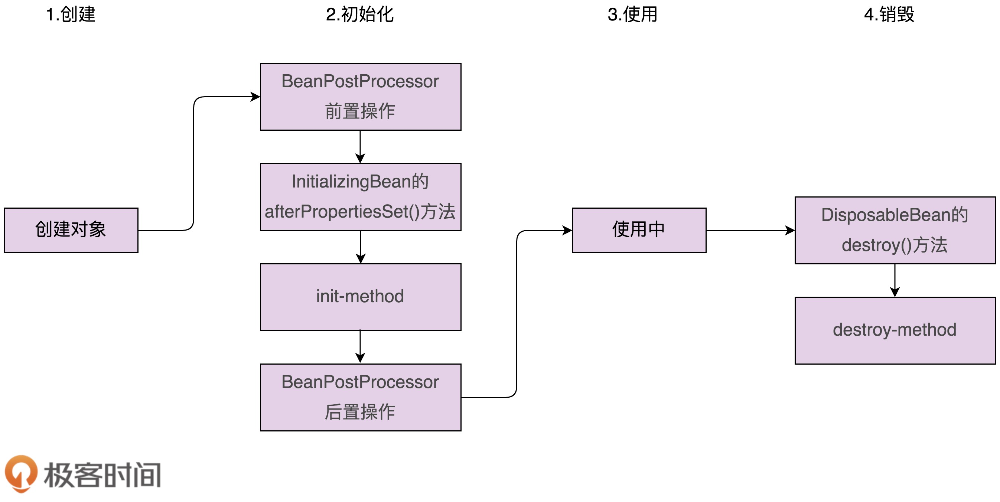

## 1 约定优于配置

使用`@RequestMapping`标注对应的url

使用 `@Transaction` 注解表明支持事务等。

通过约定的代码结构或者命名来减少配置。说直白点，就是提供配置的默认值，优先使用默认值。

比如：Spring JPA 约定类名和表明相同，属性名默认和表字段名相同，如果不一样，才需要声明。

## 2 低侵入、松耦合

可以很轻松换到其他框架

## 3 模块化、轻量级

spring整体生态很强大，但是模块化很好，可以轻松使用确定的少部分模块。

## 4 观察者模式怎么在spring中实现的？

1. 创建event时间
2. 创建listener监听
3. 定义一个发送者
4. 发送者调用 ApplicationContext，发送事件
5. 观察者要被注册到被观察者或者事件总线中。Spring中就是注册到了ApplicationContext。

真正的消息发送，实际上是通过 ApplicationEventMulticaster 这个类来完成的，具体来说，是 multicastEvent() 这个消息发送函数。

## 5 模板模式在spring中是怎么使用的？

请你说下 Spring Bean 的创建过程包含哪些主要的步骤。这其中就涉及模板模式。

Spring Bean 的创建过程，可以大致分为两大步：对象的创建和对象的初始化

### 5.1 对象的创建

1）对象的创建是通过反射来动态生成对象，而不是 new 方法。

### 5.2 对象的初始化

1）对象的初始化有两种实现方式。一种是在类中自定义一个初始化函数，并且通过配置文件，显式地告知 Spring，哪个函数是初始化函数；

2）Spring 提供了另外一个定义初始化函数的方法，那就是让类实现 Initializingbean 接口。这个接口包含一个固定的初始化函数定义（afterPropertiesSet() 函数）

    public interface BeanPostProcessor {
      Object postProcessBeforeInitialization(Object var1, String var2) throws BeansException;
    
      Object postProcessAfterInitialization(Object var1, String var2) throws BeansException;
    }
    
## 6 模板模式在Spring中的应用

Spring 定义了统一的接口 HandlerAdapter，并且对每种 Controller 定义了对应的适配器类。
这些适配器类包括：AnnotationMethodHandlerAdapter、SimpleControllerHandlerAdapter、SimpleServletHandlerAdapter 等

    // 之前的实现方式
    Handler handler = handlerMapping.get(URL);
    if (handler instanceof Controller) {
      ((Controller)handler).handleRequest(...);
    } else if (handler instanceof Servlet) {
      ((Servlet)handler).service(...);
    } else if (hanlder 对应通过注解来定义的Controller) {
      反射调用方法...
    }
    
    // 现在实现方式
    HandlerAdapter handlerAdapter = handlerMapping.get(URL);
    handlerAdapter.handle(...);    